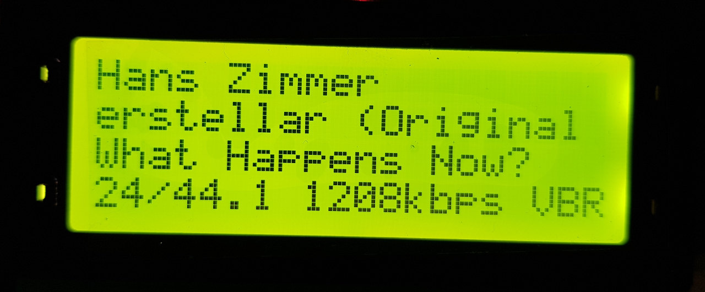

# LCD display for LMS

Show information on an LCD screen from a Logitech Media Server (like https://www.daphile.com).

* lcd_20x4.py : for an LCD 20x4 screen
* lcd_ili9341.py : for an ili9341 screen (not tested yet, WIP)

# Features

**lcd_20x4.py**:

* Support arguments: server, lcd address, i2cport, inet interface
* Scrolling text if too long
* At Start:
  * Line 2: IP where the script is running
  * Line 3: LMS version
  * Line 4: IP of the LMS Server
* After few seconds:
  * Line 2: Last scan info
  * Line 3: Total Albums
  * Line 4: Total Songs
* While Playing:
  * Line 1: Artist
  * Line 2: Album (Year)
  * Line 3: Song Title
  * Line 4: SampleRate / Bitrate / Type (FLACS, DSF, MP3 etc...)
  * Line 4: Track Numer / Total Tracks 
  * Line 4: Song info : Elapsed Time (Total Time)
* No Music:
  * Line 1: IP Where script is running
  * Line 2: Date
  * Line 3: Clock
  * Line 4: Info on Missing LMS

**lcd_ili9341**:

* WIP

# Demo

# Python modules used

**lcd_20x4.py**:

* smbus
* netifaces
* socket
* signal
* json
* argparse

**lcd_ili9341.py**:

* netifaces
* socket
* signal
* json
* argparse
* PIL
* urllib2
* adafruit_rgb_display
* digitalio
* board

# Common Arguments Options 

* **-s --server** ip and port for the server. something like 192.168.1.192:9000
* **-e --inet** Network Interface to use

## Additional for lcd_20x4

* **-l --lcd** LCD address something like 0x27
* **-i --i2cport** i2cdetect port, 0 or 1, 0 for Orange Pi Zero, 1 for Rasp > V2

./lcd_20x4.py -s 10.0.1.29:9000 -l 0x27 -i 1 -e eth0

# Original idea

https://github.com/renaudrenaud/LMSLCD2020

# External Source and code

* http://www.gejanssen.com/howto/i2c_display_2004_raspberrypi/index.html
* https://www.circuitbasics.com/raspberry-pi-i2c-lcd-set-up-and-programming/
* https://readthedocs.org/projects/rplcd/downloads/pdf/latest/
* https://www.raspberrypi.org/forums/viewtopic.php?t=194423
* https://www.balena.io/blog/add-a-cheap-ili9341-lcd-to-your-resin-io-raspberry-pi-project/
* https://github.com/adafruit/Adafruit_CircuitPython_RGB_Display
